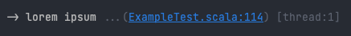
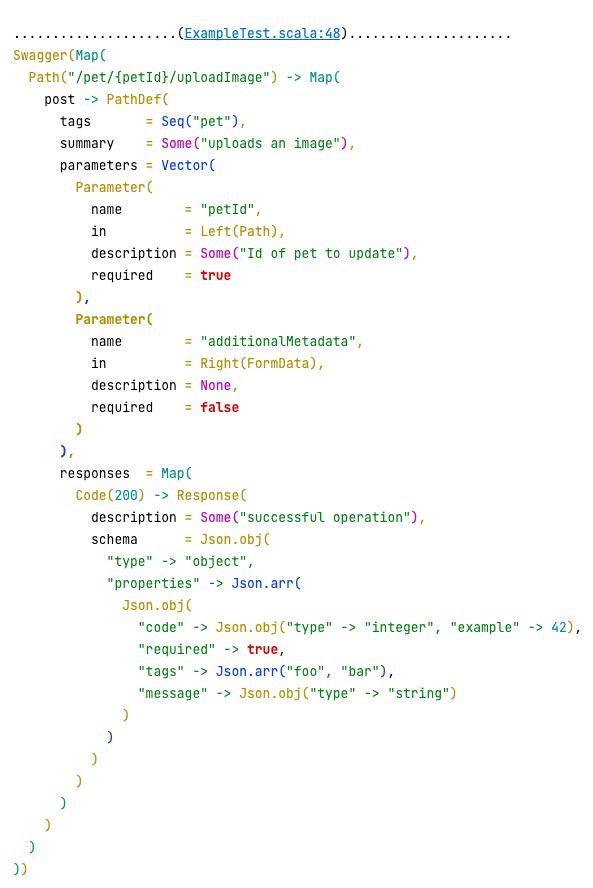
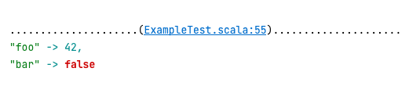
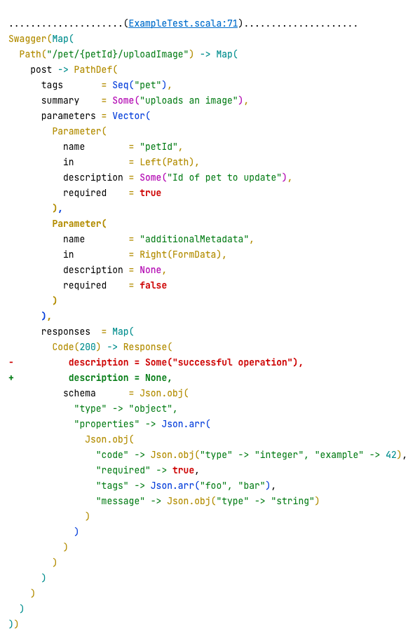
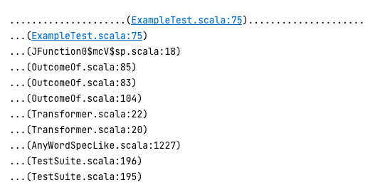
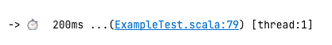

# ytil

Ytil is my personal util-library which I use for debugging in my daily work (mostly in tests). It all started with 
a single function `prettyFormat` ([inspired by this gist](https://gist.github.com/carymrobbins/7b8ed52cd6ea186dbdf8)) 
and eventually grew into my personal tool-kit.

#### Why I need it:
I have been using Jetbrains IDEs for many years, and I love its functionality, including Run/Debug features.
However, in bigger Scala projects it really suffers sometimes from performance issues, especially when started Run/Debug
processes overlap with code-completion. So at some point I started using IDE only for code editing, while running tests
in watch-mode in SBT console, and this is where these utils started helping me a lot.

#### How I install it:
I do not install it in my projects in a normal way (via SBT). 
Instead, I create a sym-link from this repository to source folders in my projects:
```shell
link -S /my/porject/root/src/main/scala/ytil /this/repo/root/src/main/scala/ytil
```
This way I can edit my utils on fly from any project whenever I want to change/add something, and all updates immediately
appear in all other projects.

Another positive side effect of this way is that I can not accidentally commit my prints into source code - 
in this case the compiler on CI will immediately fail because these functions do not exist there.

#### Why the package name is just `ytil`:
It's to be able to use my functions without any imports and still keeping them short:
```scala
// instead of
com.my.super.awesome.package.prettyPrint(42)
// or
import com.my.super.awesome.package.prettyPrint
prettyPrint(42)
// it's just
ytil.prettyPrint(42)
```
I have a bunch of shortcuts in IDE to quickly summon every function:
`ll` for `ytil.log()`, `pp` for `ytil.prettyPrint()`, `dd` for `ytil.prettyDiff()` and so on.

### Examples
You can find all these examples in the [ExampleTest.scala](./src/test/scala/ytil/ExampleTest.scala).

Note: each function also prints the line where it's used, and Intellij converts into a proper link. 
```scala
// just a simple log-message (helpful for tracing)
ytil.log(s"lorem ipsum")
```
> 
```scala
// pretty-prints any variable
// the printed result is a valid Scala code, so it can be copy-pasted back to editor 
ytil.prettyPrint(swagger)
```
> 
```scala
// same as prettyPrint, but allows to print multiple variables as key-values
ytil.prettyPrintMap(
  "foo" -> 42,
  "bar" -> false
)
```
> 
```scala
// this functions is simple stupid - it just pretty-formats 2 values and then calculates the diff line by line
ytil.prettyDiff(expected, actual)
```
> 
```scala
// it's useful when I need to quickly trace a call-stack 
ytil.trace(limit = 10)
```
> 
```scala
// makes it easy to track sleep-calls
// and also it does not let me to forget about them and accidentally commit
ytil.sleep(200)
```
> 