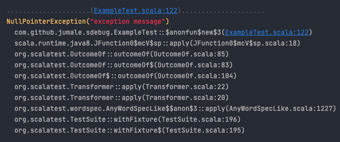
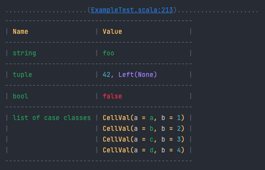

# Scala Debugging Utils

This library provides basic tools for debugging Scala code in console: pretty-printing variables, diffs, and some more.<br>
It is my personal util-library which I use for debugging in my daily work (mostly in tests). It's all started with 
a single function `prettyFormat` ([inspired by this gist](https://gist.github.com/carymrobbins/7b8ed52cd6ea186dbdf8)) 
and eventually grew into my personal tool-kit.

### Use case
I use this library during development when writing/debugging tests and code in Intellij IDE.<br>
Sometimes it's even quicker and looks better than native debugging in IDE with break-points, and sometimes it's the only way to debug
if IDE fails to run/debug code because of some internal configuration problems.<br>
All functions in this library also print breadcrumbs, which is recognised by Intellij as a code-link, so that it's easy to find
and remove all debugging before committing changes.<br>
I always use this library as a globally installed package on my machine - this way I always ensure that if I forget to
delete any of my prints before commit/push, then a CI build should fail and send me a notification (because this library exists 
only on the developer's machine).

### Installation
This is my default way of installation, assuming that I use PlayJson and Scalatest in all my projects:
- clone this project locally
- go to the root folder and run `sbt +publishLocal`
- create if not exists `~/.sbt/1.0/global.sbt` (or `~/.sbt/0.13/global.sbt` for older SBT) with contents:
```scala
libraryDependencies ++= Seq(
  "com.github.jumale" %% "sdebug-core"      % "0.1.0-SNAPSHOT",
  "com.github.jumale" %% "sdebug-play-json" % "0.1.0-SNAPSHOT",
  "com.github.jumale" %% "sdebug-scalatest" % "0.1.0-SNAPSHOT",
  "com.github.jumale" %% "sdebug-shortcut"  % "0.1.0-SNAPSHOT"
)
```
The `sdebug-shortcut` package is the aggregation of core, play-json and scalatest with a shortcut access to functions
like `sdebug.functioName(...)`. If you do not need play-json or scalatest, or need support for some other libraries - then
you can just use the core library and extend it the way you need.

### Functions
You can find all these examples in the [ExampleTest.scala](./core/src/test/scala/com/github/jumale/sdebug/ExampleTest.scala).

---
```scala
// just a simple log-message (helpful for tracing logic flows)
sdebug.log(s"lorem ipsum")
```


---
```scala
// pretty-prints any variable
// the printed result is a valid Scala code, so it can be copy-pasted back to IDE if needed
sdebug.dump(swagger)
// also can print multiple values: sdebug.dump(foo, bar, baz)
```


---
```scala
// exceptions are printed with stack-trace
// the stack-trace length is limited to 10 by default but it can be changed via render-params 
sdebug.dump(exception)
```


---
```scala
// prints diffs between two values
// the diff is calculated recursively, and shows precisely which key or value has been changed/added/deleted
sdebug.diff(left, right)
```


---
```scala
// just prints a stack-trace to the current line 
sdebug.trace(limit = 10)
```


---
```scala
// a wrapper for Thread.sleep, which also prints breadcrumbs, so that it can't be accidentally forgotten in code 
sdebug.sleep(200)
```


---
```scala
// printing results in table format 
sdebug.table(
  Seq("Name", "Value"),
  Seq("string", "foo"),
  Seq("tuple", (42, Left(None))),
  Seq("bool", false),
  Seq("list of case classes", List(CellVal("a", 1), CellVal("b", 2), CellVal("c", 3), CellVal("d", 4)))
)
```


---
```scala
// measures execution time of the provided code-block 
// also supports custom name: sdebug.measure("customName")(myFunction())
sdebug.measure(myFunction())
```


---
```scala
// same as 'dump', but saves results into the specified file instead of printing
// the result is also de-colorized
sdebug.save("filename.txt")(foo, bar, baz)
```